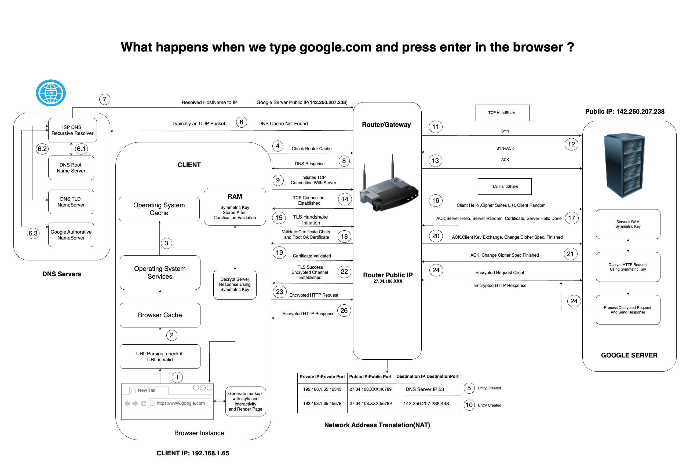

# What Happens When We Type `google.com` and Press Enter in the Browser?

## URL Parsing and Validation
1. The browser parses the URL and checks if it is valid.
2. If valid, the browser generates the markup with style and interactivity and renders the page.

## Operating System Cache
3. The browser checks the operating system cache for a DNS (Domain Name System) record of `google.com`.
4. If the cache contains the DNS record, it uses the IP address from the cache.
5. If not, it proceeds to the next step.

## Operating System Services
6. The browser interacts with the operating system services to resolve the domain name.

## DNS Lookup
7. The operating system sends a DNS query to the DNS server configured on the client machine.
8. Typically, the DNS server is the ISP's (Internet Service Provider) DNS server or a DNS server like Google DNS.

## Recursive DNS Resolver
9. The ISP's DNS server acts as a recursive resolver, which means it will query other DNS servers on behalf of the client if it does not have the DNS record in its cache.

## DNS Query Process
10. The query first goes to the DNS Root Name Server.
11. Then it goes to the TLD (Top-Level Domain) Name Server for `.com` domains.
12. Finally, it goes to the Google Authoritative Name Server.

## DNS Response
13. The authoritative name server responds with the IP address for `google.com`.

## DNS Cache Update
14. The ISP DNS server caches this response for future queries.
15. The client machine's operating system also caches the DNS response.

## TCP Connection Establishment
16. The client initiates a TCP (Transmission Control Protocol) connection to the resolved IP address of `google.com`.
17. A three-way handshake process starts:
    - **SYN**: The client sends a SYN (synchronize) packet to the server.
    - **SYN-ACK**: The server responds with a SYN-ACK (synchronize-acknowledge) packet.
    - **ACK**: The client sends an ACK (acknowledge) packet, establishing the connection.

## TLS Handshake
18. The client initiates a TLS (Transport Layer Security) handshake to secure the connection.
19. Steps include:
    - Client Hello, where the client sends a list of supported cipher suites.
    - Server Hello, where the server selects a cipher suite and sends its certificate.
    - Certificate validation by the client.
    - Key exchange and encryption establishment.

## Encrypted HTTP Request
20. Once the secure connection is established, the client sends an encrypted HTTP request to the server.

## Server Processing
21. The server decrypts the HTTP request using the symmetric key established during the TLS handshake.
22. The server processes the request and prepares a response.

## Encrypted HTTP Response
23. The server encrypts the HTTP response using the symmetric key and sends it back to the client.

## Response Decryption
24. The client decrypts the HTTP response using the symmetric key.

## Rendering the Web Page
25. The browser processes the HTML, CSS, and JavaScript in the response and renders the webpage to the user.

## Detailed Flow with Diagram Annotations
1. **URL Parsing, Browser Cache Check (Client Side)**
    - **1:** Browser parses the URL and checks the cache.
    - **3:** If not found, checks the OS cache.

2. **DNS Query (Client and DNS Servers)**
    - **4-6.3:** DNS query is sent to the recursive resolver which queries root, TLD, and authoritative name servers.

3. **TCP Connection Establishment (Client and Router/Gateway)**
    - **11-13:** SYN, SYN-ACK, ACK packets exchanged between client and server.

4. **TLS Handshake (Client and Router/Gateway)**
    - **15-20:** TLS handshake steps including Client Hello, Server Hello, certificate validation, and key exchange.

5. **Encrypted HTTP Communication (Client, Router/Gateway, Server)**
    - **21-24:** Encrypted HTTP request sent to the server and encrypted response received and decrypted.

6. **Rendering and Final Display (Client Side)**
    - **25-26:** Browser processes and renders the decrypted response.
