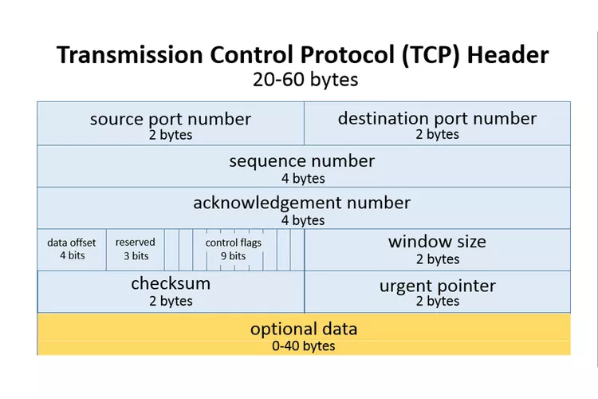

## Question
How many bytes is the TCP header? What are the different fields? How are the values set?

## Answer

### TCP Header Size

The Transmission Control Protocol (TCP) header is **20 bytes** (or 160 bits) in its minimum form. However, it can be larger if options are included, with a maximum size of **60 bytes**.

### Fields in the TCP Header

The TCP header consists of several fields, which are outlined below:

| Field               | Size (bits) | Description                                                                                 |
|---------------------|-------------|---------------------------------------------------------------------------------------------|
| Source Port         | 16          | The port number of the application at the sender's side.                                  |
| Destination Port    | 16          | The port number of the application at the receiver's side.                                 |
| Sequence Number      | 32          | The sequence number of the first byte of data in this segment.                            |
| Acknowledgment Number | 32          | The sequence number of the next byte that the sender of the segment expects to receive.   |
| Data Offset         | 4           | The size of the TCP header in 32-bit words. This field indicates where the data begins.   |
| Reserved            | 3           | Reserved for future use; should be set to zero.                                           |
| Flags               | 9           | Control flags (e.g., SYN, ACK, FIN, etc.) indicating the state of the connection.        |
| Window Size         | 16          | The size of the sender's receive window (buffer space available).                         |
| Checksum            | 16          | Used for error-checking the header and data.                                              |
| Urgent Pointer      | 16          | Indicates if there is urgent data in this segment; points to the urgent data byte.       |
| Options             | Variable     | Optional field for various TCP options (e.g., Maximum Segment Size).                     |
| Padding             | Variable     | Added to ensure the header is a multiple of 32 bits.                                      |

### How Field Values are Set

1. **Source Port**: Set by the sending application. It identifies the port from which the segment is sent.

   Example: If a web server sends data from port 80, the Source Port will be set to 80.

2. **Destination Port**: Set by the sending application to indicate where the data should go.

   Example: If data is sent to a web server, the Destination Port will be set to 80.

3. **Sequence Number**: This field is set to the sequence number of the first byte of data being sent in this segment.

   Example: If the first byte of data is 1000, the Sequence Number will be 1000.

4. **Acknowledgment Number**: This field is set to the next expected byte from the sender.

   Example: If the sender has received bytes up to 1000, it will set this field to 1001.

5. **Data Offset**: This field is calculated based on the size of the TCP header in 32-bit words.

   Example: If the TCP header is 20 bytes, the Data Offset will be set to 5 (20/4).

6. **Flags**: Control flags are set based on the state of the connection.

   Example: If a segment is initiating a connection, the SYN flag will be set.

7. **Window Size**: Set by the sender to indicate the size of the available buffer space for incoming data.

   Example: If the sender has 5000 bytes of buffer space, this field will be set to 5000.

8. **Checksum**: Calculated by summing the TCP header and data, and then computing the 1's complement.

9. **Urgent Pointer**: This is set if the Urgent flag is set and indicates the position of urgent data in the segment.

### Example of a TCP Header

Below is an illustration of a TCP header with field sizes:

### Conclusion

The TCP header is crucial for establishing a reliable connection between devices in a network. Each field plays a vital role in ensuring that data is transmitted accurately and efficiently.

