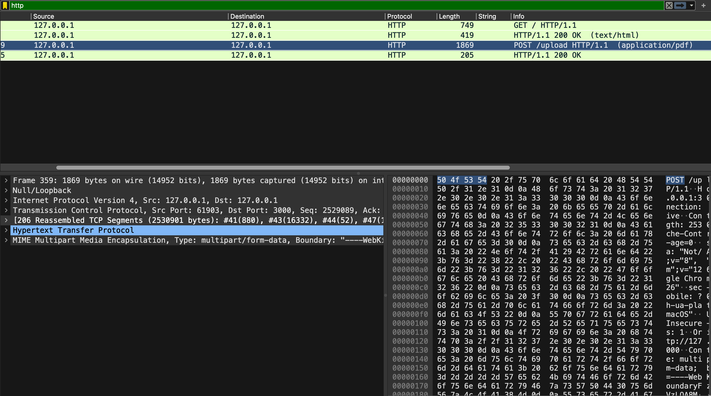
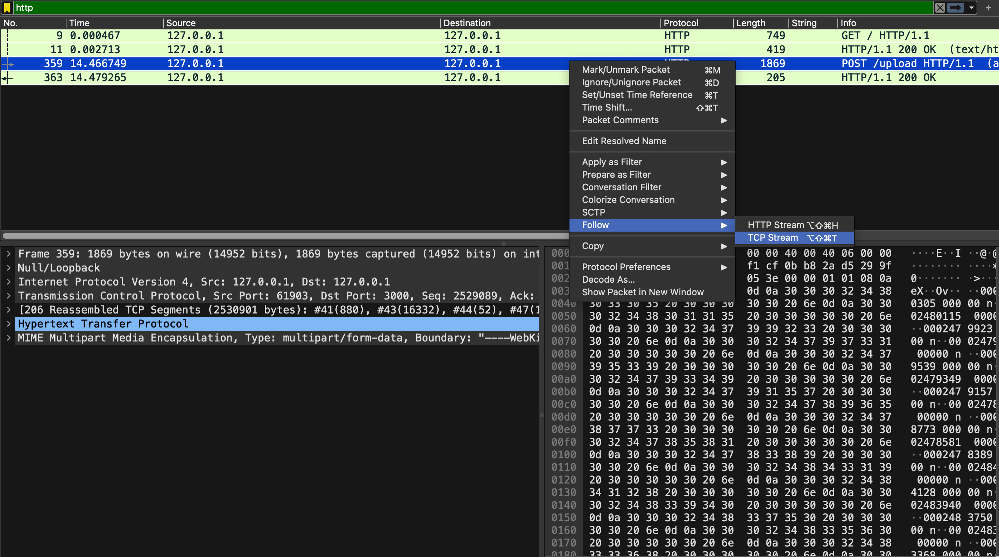
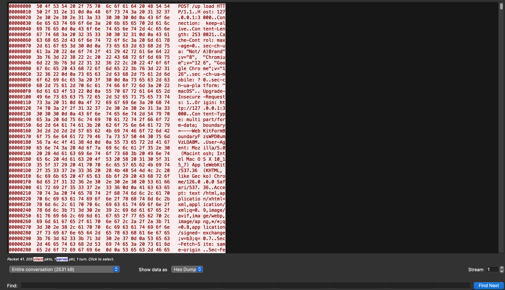
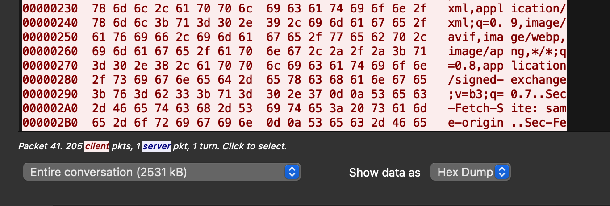

# Analyzing File Upload with Wireshark

This markdown shows how to capture and analyze a file upload using Wireshark.

## Prerequisites

- Install Wireshark from [Wireshark's official website](https://www.wireshark.org/).

## Steps to Capture File Upload

1. **Start Wireshark and Capture Traffic**

   - Open Wireshark.
   - Select the network interface that the file upload will occur over.(if you have started    the server in your own machine then select the loopback interface)
   - Start capturing traffic by clicking the blue shark fin icon.

2. **Filter HTTP Traffic**

   - In the filter bar, type `http` to filter HTTP traffic.
   - Press Enter to apply the filter.

   

3. **Locate the File Upload Request**

   - Identify the HTTP POST request that initiates the file upload.
   - The POST request will likely have a large payload if you are uploading a file.

   

4. **Follow the TCP Stream**

   - Right-click on the POST request packet.
   - Select "Follow" > "TCP Stream".

   

   - This will display all the packets exchanged between the client and the server during the file upload.
   - Below we can see that there are altogether 205 client packets and 1 server packet.

5. **Analyze the TCP Segments**

   - In the TCP stream view, you can see all the TCP segments exchanged.
   - You can view different TCP segments lenght and starting and ending bytes transfered from the TCP layer in the window pane.
   - Observe the sequence numbers and the length of each segment to understand how the file was divided.

   

   - Close the TCP stream view to return to the main Wireshark window.
   - Use the filter `tcp.stream eq <stream_number>` (replace `<stream_number>` with the actual stream number found in the TCP stream view) to isolate the specific TCP stream for the file upload.
   - Count the number of segments (packets) in this stream.

## Summary

By following these steps, you can capture and analyze how a file is uploaded over the network, including how it is divided into TCP segments. This is useful for performance analysis and troubleshooting.

## Screenshots

- **HTTP Filter**
  

- **HTTP POST Request**
  

- **Follow TCP Stream**
  

- **TCP Stream View**
  

## Notes

- Ensure you have permission to capture and analyze network traffic.
- This guide assumes a basic understanding of HTTP and TCP protocols.

