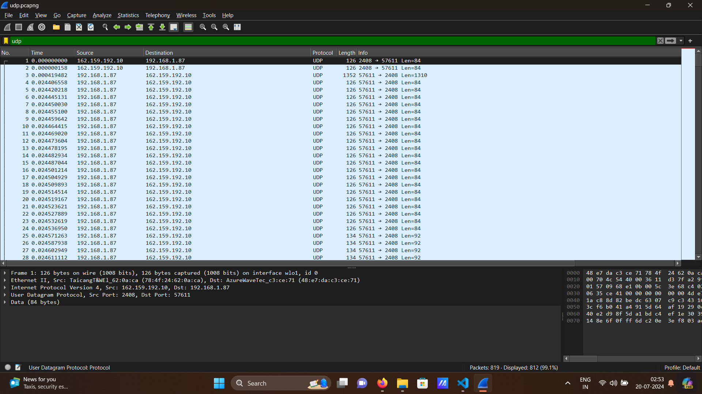
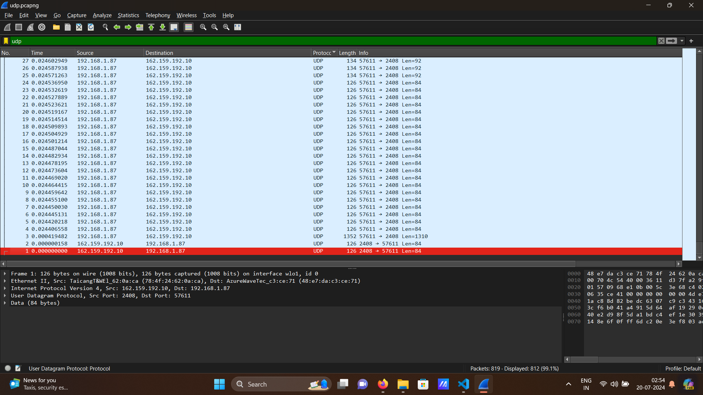
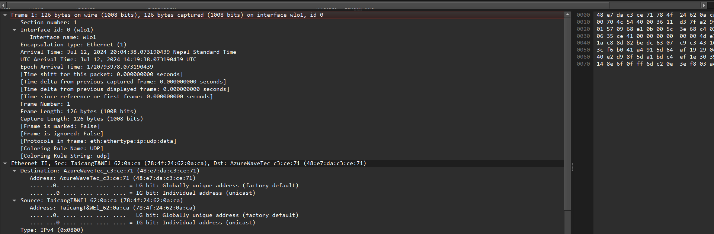
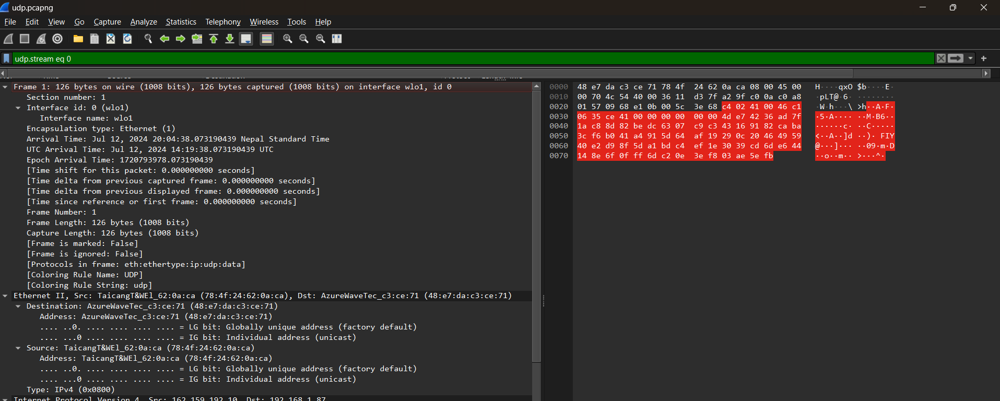
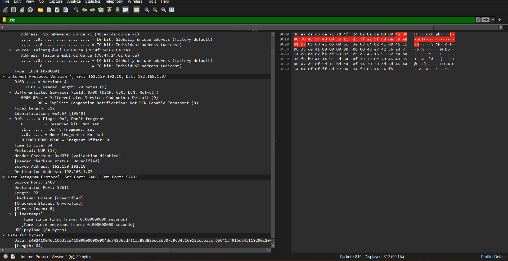
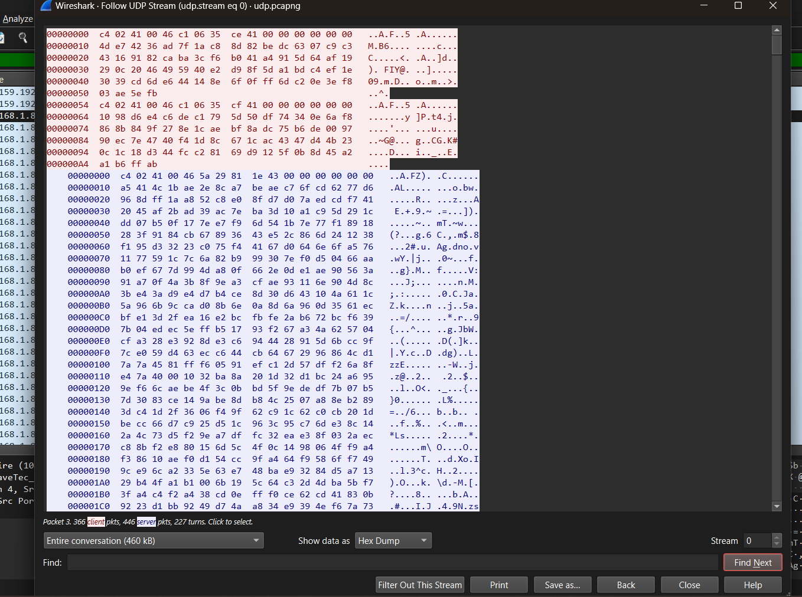

# Analyzing UDP Packets with Wireshark

This markdown shows how to capture and analyze a UDP packet using Wireshark.

## Prerequisites

- Install Wireshark from [Wireshark's official website](https://www.wireshark.org/).

## Steps to Capture UDP Packets

1. **Start Wireshark and Capture Traffic**

   - Open Wireshark.
   - Select the network interface that the UDP packets will traverse. If you are capturing traffic on your own machine, you may select the loopback interface.
   - Start capturing traffic by clicking the blue shark fin icon.

2. **Filter UDP Traffic**

   - In the filter bar, type `udp` to filter UDP traffic.
   - Press Enter to apply the filter.

   

3. **Locate the UDP Packet**

   - Identify the UDP packet of interest in the captured traffic.
   - You can sort by Protocol column to locate UDP packets easily.

   

4. **Inspect the UDP Packet**

   - Click on the UDP packet to view its details in the lower pane of Wireshark.

   
   
   
   
   
   
   

## Analyzing the UDP Packet

### General Information

- **Frame Number**: 1
- **Frame Length**: 126 bytes (1008 bits)
- **Captured Length**: 126 bytes (1008 bits)
- **Interface**: `wlo1`
- **Arrival Time**: 
  - Local: Jul 12, 2024 20:04:38.073190439 Nepal Standard Time
  - UTC: Jul 12, 2024 14:19:38.073190439 UTC
  - Epoch: 1720793978.073190439
- **Protocols in Frame**: `eth:ethertype:ip:udp:data`
- **Coloring Rule**: UDP

### Ethernet II Header

- **Destination MAC Address**: `48:e7:da:c3:ce:71` (AzureWave Technologies)
  - **Address**: AzureWave Technologies (`48:e7:da:c3:ce:71`)
  - **LG Bit**: Globally unique address (factory default)
  - **IG Bit**: Individual address (unicast)
- **Source MAC Address**: `78:4f:24:62:0a:ca` (Taicang T&W Electronics)
  - **Address**: Taicang T&W Electronics (`78:4f:24:62:0a:ca`)
  - **LG Bit**: Globally unique address (factory default)
  - **IG Bit**: Individual address (unicast)
- **Type**: IPv4 (0x0800)

### IPv4 Header

- **Version**: IPv4 (4)
- **Header Length**: 20 bytes
- **Total Length**: 112 bytes
- **Identification**: `0x4c54` (19540)
- **Flags**: 
  - Don't fragment: Set (0x2)
- **Fragment Offset**: 0
- **Time to Live (TTL)**: 54
- **Protocol**: UDP (17)
- **Header Checksum**: `0xd37f` (unverified)
- **Source Address**: `162.159.192.10`
- **Destination Address**: `192.168.1.87`

### UDP Header

- **Source Port**: `2408`
- **Destination Port**: `57611`
- **Length**: 92 bytes
- **Checksum**: `0x3e68` (unverified)

### Data Payload

- **Length**: 84 bytes
- **Data**:

c402410046c10635ce410000000000004de74236ad7f1ac88d82bedc6307c9c343169182caba3cf6b041a4915d64af19290c2046495940e2d98f5da1bdc4ef1e3039cd6de644148e6f0fff6dc20e3ef803ae5efb

markdown

## Summary

By following these steps, you can capture and analyze UDP packets over the network. This analysis includes details about the Ethernet, IP, and UDP headers, as well as the data payload. This is useful for network troubleshooting and understanding data flow.

## Screenshots

- **UDP Filter**

- **UDP Packet**

- **Inspect UDP Packet**

   
   
   
   
   

## Notes

- Ensure you have permission to capture and analyze network traffic.
- This guide assumes a basic understanding of UDP and IP protocols.